# [📈 Live Status](https://upptime.github.io/upptime): <!--live status--> **🟩 All systems operational**

<!--start: status pages-->
<!-- This summary is generated by Upptime (https://github.com/upptime/upptime) -->
<!-- Do not edit this manually, your changes will be overwritten -->
<!-- prettier-ignore -->
| URL | Status | History | Response Time | Uptime |
| --- | ------ | ------- | ------------- | ------ |
|  OpenAudioMc-Client | 🟩 Up | [open-audio-mc-client.yml](https://github.com/OpenAudioMc/status/commits/HEAD/history/open-audio-mc-client.yml) | 

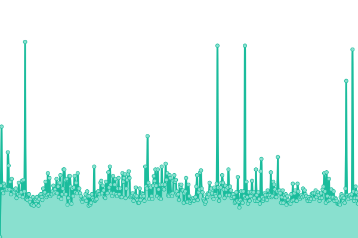 59ms
     
 | 

<a href="https://OpenAudioMc.github.io/status/history/open-audio-mc-client">99.69%</a>
    

|  OpenAudioMc-DocProxy | 🟩 Up | [open-audio-mc-doc-proxy.yml](https://github.com/OpenAudioMc/status/commits/HEAD/history/open-audio-mc-doc-proxy.yml) | 

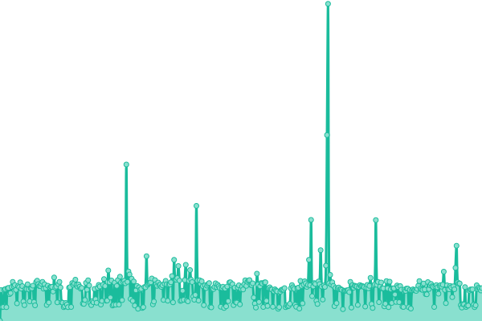 156ms
     
 | 

<a href="https://OpenAudioMc.github.io/status/history/open-audio-mc-doc-proxy">99.70%</a>
    

|  Craftmend-Accounts | 🟩 Up | [craftmend-accounts.yml](https://github.com/OpenAudioMc/status/commits/HEAD/history/craftmend-accounts.yml) | 

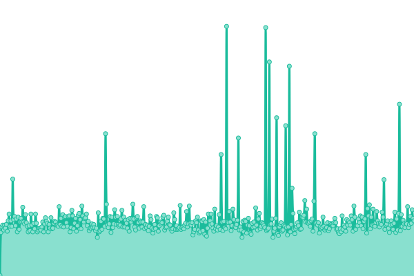 97ms
     
 | 

<a href="https://OpenAudioMc.github.io/status/history/craftmend-accounts">99.68%</a>
    

|  OpenAudioMc-SessionAPI | 🟩 Up | [open-audio-mc-session-api.yml](https://github.com/OpenAudioMc/status/commits/HEAD/history/open-audio-mc-session-api.yml) | 

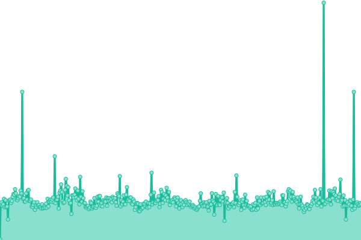 63ms
     
 | 

<a href="https://OpenAudioMc.github.io/status/history/open-audio-mc-session-api">100.00%</a>
    

|  OpenAudioMc-MediaAPI | 🟩 Up | [open-audio-mc-media-api.yml](https://github.com/OpenAudioMc/status/commits/HEAD/history/open-audio-mc-media-api.yml) | 

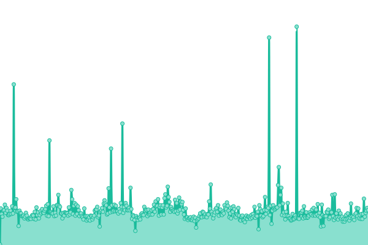 62ms
     
 | 

<a href="https://OpenAudioMc.github.io/status/history/open-audio-mc-media-api">100.00%</a>
    

|  Cluster Managment Portal | 🟩 Up | [cluster-managment-portal.yml](https://github.com/OpenAudioMc/status/commits/HEAD/history/cluster-managment-portal.yml) | 

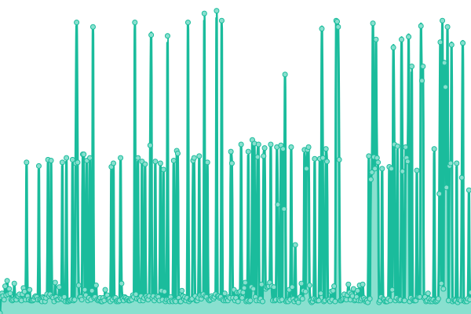 59ms
     
 | 

<a href="https://OpenAudioMc.github.io/status/history/cluster-managment-portal">99.70%</a>
    

|  OpenAudioMc-CDN | 🟩 Up | [open-audio-mc-cdn.yml](https://github.com/OpenAudioMc/status/commits/HEAD/history/open-audio-mc-cdn.yml) | 

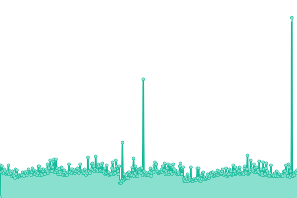 32ms
     
 | 

<a href="https://OpenAudioMc.github.io/status/history/open-audio-mc-cdn">100.00%</a>
    

|  OpenAudioMc-DiscordBot | 🟩 Up | [open-audio-mc-discord-bot.yml](https://github.com/OpenAudioMc/status/commits/HEAD/history/open-audio-mc-discord-bot.yml) | 

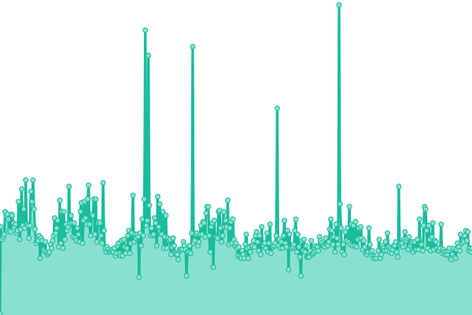 66ms
     
 | 

<a href="https://OpenAudioMc.github.io/status/history/open-audio-mc-discord-bot">100.00%</a>
    

|  OpenAudioMc-Grafana | 🟩 Up | [open-audio-mc-grafana.yml](https://github.com/OpenAudioMc/status/commits/HEAD/history/open-audio-mc-grafana.yml) | 

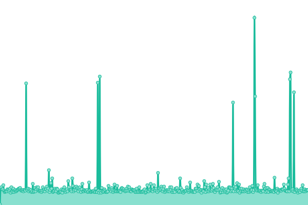 27ms
     
 | 

<a href="https://OpenAudioMc.github.io/status/history/open-audio-mc-grafana">100.00%</a>
    

|  SnowDNS-YouTube | 🟩 Up | [snow-dns-you-tube.yml](https://github.com/OpenAudioMc/status/commits/HEAD/history/snow-dns-you-tube.yml) | 

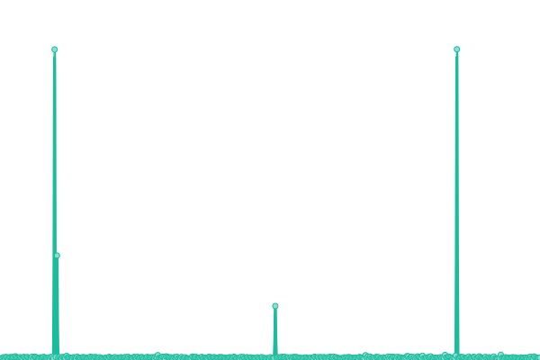 86ms
     
 | 

<a href="https://OpenAudioMc.github.io/status/history/snow-dns-you-tube">99.90%</a>
    

|  OpenAudioMc-CacheAPI | 🟩 Up | [open-audio-mc-cache-api.yml](https://github.com/OpenAudioMc/status/commits/HEAD/history/open-audio-mc-cache-api.yml) | 

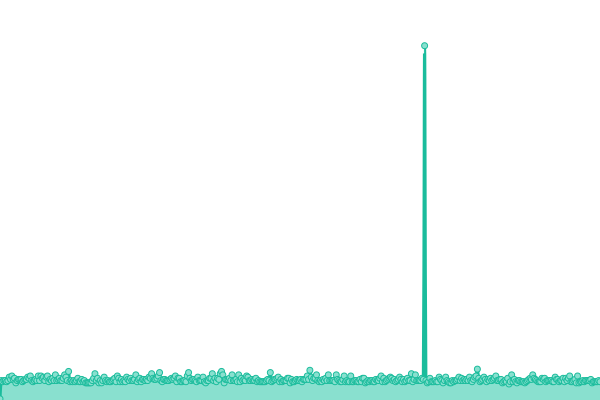 24ms
     
 | 

<a href="https://OpenAudioMc.github.io/status/history/open-audio-mc-cache-api">100.00%</a>
    

|  OpenAudioMc-CCA-ImagineFun | 🟩 Up | [open-audio-mc-cca-imagine-fun.yml](https://github.com/OpenAudioMc/status/commits/HEAD/history/open-audio-mc-cca-imagine-fun.yml) | 

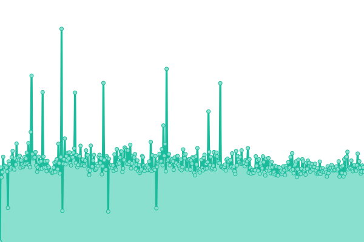 814ms
     
 | 

<a href="https://OpenAudioMc.github.io/status/history/open-audio-mc-cca-imagine-fun">99.57%</a>
    

|  OpenAudioMc-CEU-Anouk | 🟩 Up | [open-audio-mc-ceu-anouk.yml](https://github.com/OpenAudioMc/status/commits/HEAD/history/open-audio-mc-ceu-anouk.yml) | 

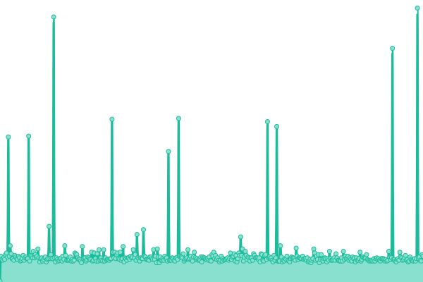 38ms
     
 | 

<a href="https://OpenAudioMc.github.io/status/history/open-audio-mc-ceu-anouk">100.00%</a>
    

|  OpenAudioMc-CEU-Paulo | 🟩 Up | [open-audio-mc-ceu-paulo.yml](https://github.com/OpenAudioMc/status/commits/HEAD/history/open-audio-mc-ceu-paulo.yml) | 

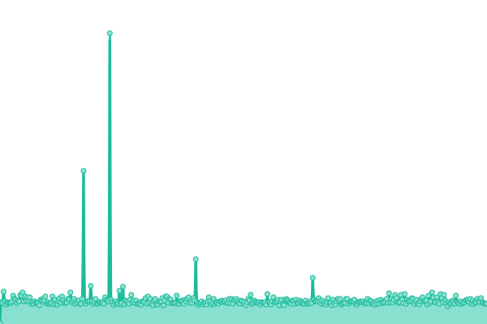 35ms
     
 | 

<a href="https://OpenAudioMc.github.io/status/history/open-audio-mc-ceu-paulo">100.00%</a>
    

|  OpenAudioMc-CEU-Ben | 🟩 Up | [open-audio-mc-ceu-ben.yml](https://github.com/OpenAudioMc/status/commits/HEAD/history/open-audio-mc-ceu-ben.yml) | 

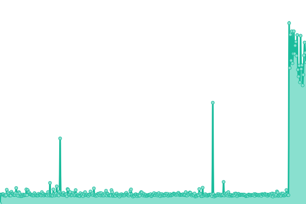 37ms
     
 | 

<a href="https://OpenAudioMc.github.io/status/history/open-audio-mc-ceu-ben">100.00%</a>
    

|  OpenAudioMc-CEU-Winter | 🟩 Up | [open-audio-mc-ceu-winter.yml](https://github.com/OpenAudioMc/status/commits/HEAD/history/open-audio-mc-ceu-winter.yml) | 

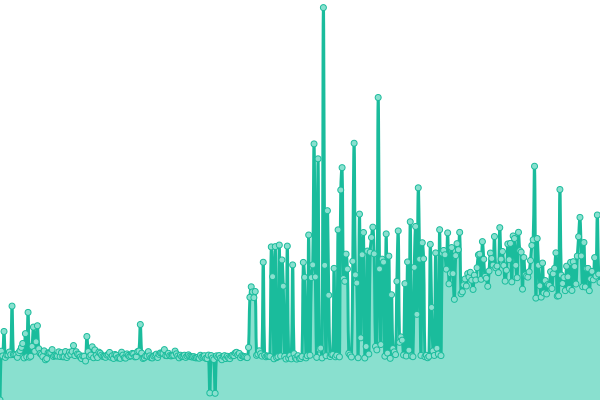 1102ms
     
 | 

<a href="https://OpenAudioMc.github.io/status/history/open-audio-mc-ceu-winter">98.50%</a>
    

|  OpenAudioMc-CEU-Playground | 🟩 Up | [open-audio-mc-ceu-playground.yml](https://github.com/OpenAudioMc/status/commits/HEAD/history/open-audio-mc-ceu-playground.yml) | 

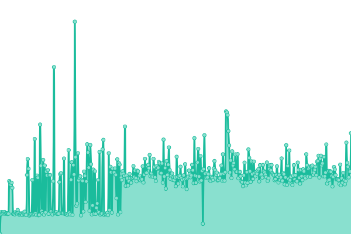 1080ms
     
 | 

<a href="https://OpenAudioMc.github.io/status/history/open-audio-mc-ceu-playground">99.88%</a>
    

|  OpenAudioMc-CEU-Spring | 🟩 Up | [open-audio-mc-ceu-spring.yml](https://github.com/OpenAudioMc/status/commits/HEAD/history/open-audio-mc-ceu-spring.yml) | 

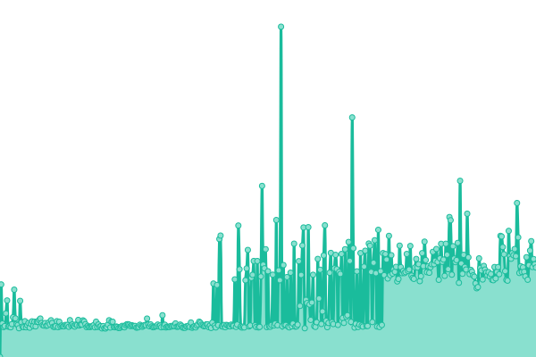 1114ms
     
 | 

<a href="https://OpenAudioMc.github.io/status/history/open-audio-mc-ceu-spring">100.00%</a>
    

<!--end: status pages-->

- Powered by: [Upptime](https://github.com/upptime/upptime)
- Code: [MIT](./LICENSE) © [Upptime](https://upptime.js.org)
