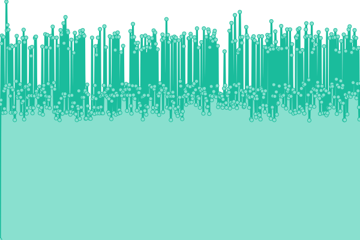
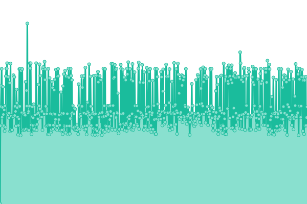
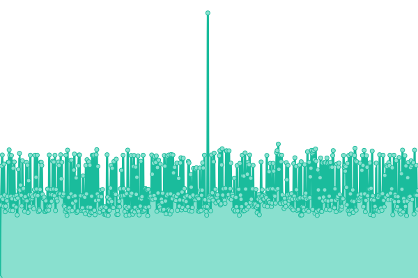
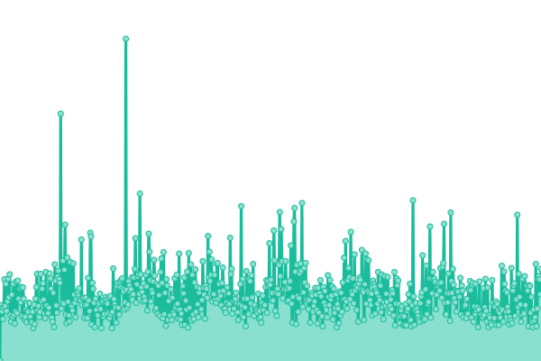
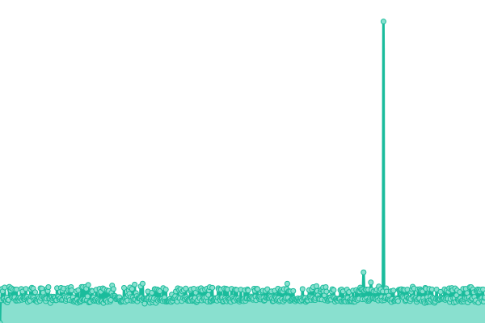
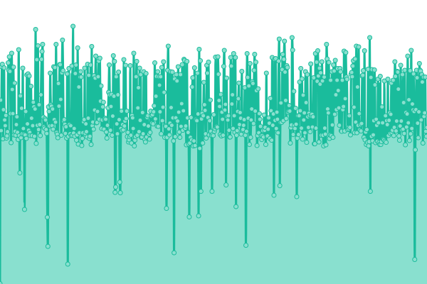
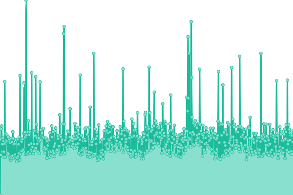
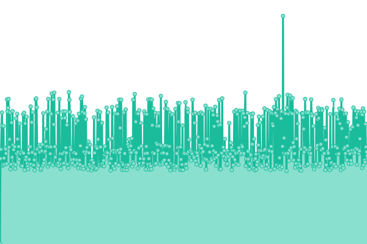

# [📈 Live Status](https://upptime.github.io/upptime): <!--live status--> **🟧 Partial outage**

<!--start: status pages-->
<!-- This summary is generated by Upptime (https://github.com/upptime/upptime) -->
<!-- Do not edit this manually, your changes will be overwritten -->
<!-- prettier-ignore -->
| URL | Status | History | Response Time | Uptime |
| --- | ------ | ------- | ------------- | ------ |
|  EU_NORTH_1 | 🟩 Up | [eu-north-1.yml](https://github.com/OpenAudioMc/status/commits/HEAD/history/eu-north-1.yml) | 

 479ms
     
 | 

<a href="https://OpenAudioMc.github.io/status/history/eu-north-1">99.90%</a>
    

|  EU_WEST_2 | 🟩 Up | [eu-west-2.yml](https://github.com/OpenAudioMc/status/commits/HEAD/history/eu-west-2.yml) | 

 386ms
     
 | 

<a href="https://OpenAudioMc.github.io/status/history/eu-west-2">99.75%</a>
    

|  EU_WEST_3 | 🟩 Up | [eu-west-3.yml](https://github.com/OpenAudioMc/status/commits/HEAD/history/eu-west-3.yml) | 

 395ms
     
 | 

<a href="https://OpenAudioMc.github.io/status/history/eu-west-3">100.00%</a>
    

|  US_EAST_1 | 🟩 Up | [us-east-1.yml](https://github.com/OpenAudioMc/status/commits/HEAD/history/us-east-1.yml) | 

 134ms
     
 | 

<a href="https://OpenAudioMc.github.io/status/history/us-east-1">100.00%</a>
    

|  OpenAudioMc-Client | 🟩 Up | [open-audio-mc-client.yml](https://github.com/OpenAudioMc/status/commits/HEAD/history/open-audio-mc-client.yml) | 

 137ms
     
 | 

<a href="https://OpenAudioMc.github.io/status/history/open-audio-mc-client">100.00%</a>
    

|  Craftmend-Accounts | 🟩 Up | [craftmend-accounts.yml](https://github.com/OpenAudioMc/status/commits/HEAD/history/craftmend-accounts.yml) | 

 496ms
     
 | 

<a href="https://OpenAudioMc.github.io/status/history/craftmend-accounts">100.00%</a>
    

|  OpenAudioMc-SessionAPI | 🟩 Up | [open-audio-mc-session-api.yml](https://github.com/OpenAudioMc/status/commits/HEAD/history/open-audio-mc-session-api.yml) | 

 489ms
     
 | 

<a href="https://OpenAudioMc.github.io/status/history/open-audio-mc-session-api">100.00%</a>
    

|  Cluster Managment Portal | 🟩 Up | [cluster-managment-portal.yml](https://github.com/OpenAudioMc/status/commits/HEAD/history/cluster-managment-portal.yml) | 

 507ms
     
 | 

<a href="https://OpenAudioMc.github.io/status/history/cluster-managment-portal">100.00%</a>
    

|  OpenAudioMc-UserContent | 🟥 Down | [open-audio-mc-user-content.yml](https://github.com/OpenAudioMc/status/commits/HEAD/history/open-audio-mc-user-content.yml) | 

 266ms
     
 | 

<a href="https://OpenAudioMc.github.io/status/history/open-audio-mc-user-content">99.91%</a>
    

|  SnowDNS-YouTube | 🟩 Up | [snow-dns-you-tube.yml](https://github.com/OpenAudioMc/status/commits/HEAD/history/snow-dns-you-tube.yml) | 

 504ms
     
 | 

<a href="https://OpenAudioMc.github.io/status/history/snow-dns-you-tube">100.00%</a>
    

|  OpenAudioMc-CacheAPI | 🟩 Up | [open-audio-mc-cache-api.yml](https://github.com/OpenAudioMc/status/commits/HEAD/history/open-audio-mc-cache-api.yml) | 

 376ms
     
 | 

<a href="https://OpenAudioMc.github.io/status/history/open-audio-mc-cache-api">100.00%</a>
    

<!--end: status pages-->

- Powered by: [Upptime](https://github.com/upptime/upptime)
- Code: [MIT](./LICENSE) © [Upptime](https://upptime.js.org)
